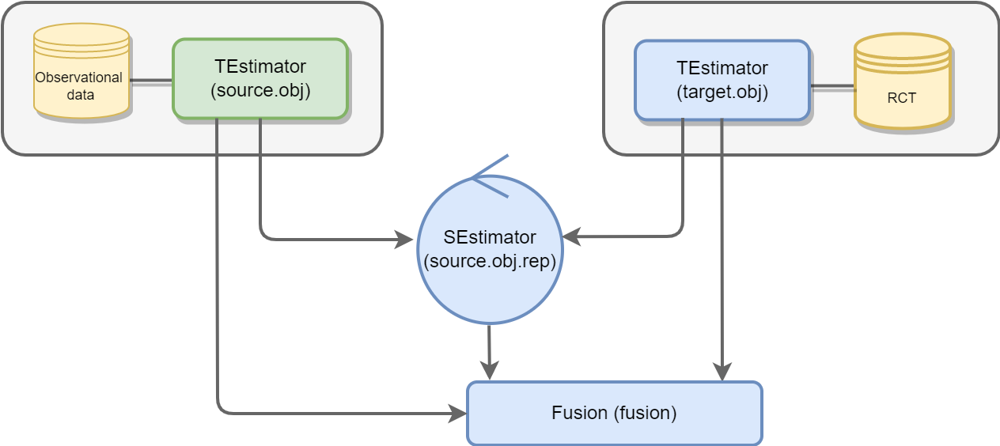

<!-- README.md is generated from README.Rmd. Please edit that file -->

```{r, include = FALSE}
knitr::opts_chunk$set(
  collapse = TRUE,
  comment = "#>",
  fig.path = "man/figures/README-",
  out.width = "100%"
)
```
# RCTrep: An R package for validation of methods for treatment effect estimation using real-world data


**RCTrep** is an R package to validate methods for **conditional average treatment effect (CATE)** estimation using **real-world data (RWD)**. Validation of methods for treatment effect estimation using RWD is challenging because we do not observe the true treatment effect for each individual  - a fundamental problem of **causal inference** - hence we can only estimate treatment effect using observed data. Randomized control trial (RCT) assigns individuals to treatment  or control groups  with known probability 
, hence two groups are balanced in terms of observed and unobserved covariates. The difference in outcomes between groups can be merely attributed to realization of treatment , and hence the treatment effect is the simple difference in means of outcomes and is unbiased given identification assumption holds. However, in case we don't know the true probability  in RWD, without knowing the ground truth, _**how can we validate the methods for treatment effect estimation?**_

## Method
**RCTrep** is an R package to enable easy validation of various methods for treatment effect estimation using RWD by comparison to RCT data. We identify under which conditions the estimate from RCT can be regarded as the ground truth for methods validation using RWD. We assume the RWD and RCT data  are two random samples from a, potentially different, population, and hence allow for a valid comparison of estimates of treatment effect between two samples after population composition is controlled for. We refer users to [RCTrep vignettes][JSS] for theoretical elaboration, in which we illustrate why estimates from RCT can be assumed as ground truth and how to use the estimates as the surrogate of the ground truth of RWD from the view of **treatment assignment mechanism** and **sampling mechansim**. We provide an diagram to show how RCT data and RWD differ in two mechanisms in the following figure:


We consider a set of candidate treatment effect estimators  , where , hence  is an estimator of conditional average treatment effect of population with characteristics . We provide the package that makes it easy to try out various estimators  and select the best one using the following evaluation metric:


where  is an unbiased estimate of the average treatment effect derived from the RCT data,  and   are the empirical density of  in RCT data and RWD,  is a weight for individuals in RWD with characteristics .  Hence the weighted distribution of covariates in RWD and distribution of covariates in the RCT data are balanced. We compute  on _**population**_ and _**sub-population**_ levels. 

## Software overview
The package use R6 Object-oriented programming system. We provide an overview of implementation of RCTrep in the following figure:



RCTrep provides two core classes, namely, **TEstimator** and **SEstimator**, which are responsible for adjusting the **treatment assignment mechanism** and the **sampling mechanism** respectively. 

**TEstimator** has three subclasses for adjusting the treatment assignment mechanism, namely,

* G-computation, 
* Inverse propensity score weighting, 
* Doubly robust estimation 

**SEstimator** has three subclasses for adjusting the sampling mechanism, namely, 

* Exact matching, 
* Inverse sampling score weighting, 
* Subclassification

Users can specify modeling approaches for sampling score, propensity score, outcome regression, and distance measure, etc. _Two objects_ instantiated using RWD and experimental RCT data _communicate within the object of the class SEstimator_, sharing either **unit-level data"** or **aggregated data** for computing the weights . 

**Summary** R6 class Summary combines estimates from an object of class TEstimate and/or an object of class SEstimate, and plots and evaluates estimates of average treatment effect and heterogeneous treatment effect. The number of objects of class TEstimator or SEstimator passed to its constructor is not limited. 

The package can also generate synthetic RCT data based on meta data from publications (point estimate and interval estimate of average treatment effect, conditional average treatment effect conditioning on univariate variable, and univariate distribution). 

## Installation

<!-- You can install the released version of RCTrep from [CRAN](https://CRAN.R-project.org) with: -->

<!-- ``` r -->
<!-- install.packages("RCTrep") -->
<!-- ``` -->

You can install the development version from [GitHub](https://github.com/) with:

``` r
# install.packages("devtools")
devtools::install_github("duolajiang/RCTrep")
```

We will realease the package to CRAN soon. 

## Quick Start
We demonstrate the simple usage of RCTrep to validate methods for treatment effect estimation. We use G-computation to adjust for the treatment assignment mechanism - the method using RWD to validate.  We use exact matching to balance covariates between RWD and RCT data, and obtain the weighted estimates of treatment effect using RWD. Then we can implement the fair comparison between weighted estimates using RWD and unbiased estimate using experimental data. Variables that may confound causal association between treatment and outcome, and variables that may lead to supurious association between sampling and outcomes still need careful investigation and identification. 

### Step 1: Identification
This step is to identifiy the variable set **confounders_treatment_name** that confound causal relation between treatment and outcome, and the variable set **confounders_sampling_name** that can induce supurious difference in estimates between RWD and RCT data. 
```{r, message=FALSE, warning=FALSE}
library(RCTrep)
source.data <- RCTrep::source.data
target.data <- RCTrep::target.data

vars_name <- list(confounders_treatment_name=c("x1","x2","x3","x4","x5","x6"),
                  treatment_name=c('z'),
                  outcome_name=c('y')
)
confounders_sampling_name <- c("x1","x2","x3","x4","x5","x6")
```

### Step 2: Estimation
#### step 2.1: Estimation of treatment effect of RWD and RCT data
```{r, message=FALSE, warning=FALSE}
source.obj <- TEstimator_wrapper(
  Estimator = "G_computation",
  data = source.data,
  name = "RWD",
  vars_name = vars_name,
  outcome_method = "glm",
  outcome_formula = y ~ x1 + x2 + x3 + z + z:x1 + z:x2 +z:x3+ z:x6,
  data.public = TRUE
)

target.obj <- TEstimator_wrapper(
  Estimator = "Crude",
  data = target.data,
  name = "RCT",
  vars_name = vars_name,
  data.public = TRUE,
  isTrial = TRUE
)
```

#### Step 2.2: Estimation of weighted treatment effect of RWD
```{r,message=FALSE, warning=FALSE}
# step2.2: Estimation of weighted treatment effect
source.obj.rep <- SEstimator_wrapper(Estimator="Exact",
                                target.obj=target.obj,
                                source.obj=source.obj,
                                confounders_sampling_name=confounders_sampling_name)
source.obj.rep$EstimateRep(stratification = c("x1","x3","x4","x5"))

```

### Step 3: Assumptions and model diagnosis
This step diagnoses model assumption for G-computation (covariats balance for IPW), treatment overlap assumption, outcome overlap assumption, and sampling overlap assumption.
```{r warning=FALSE, paged.print=TRUE}
source.obj$diagnosis_t_ignorability()
source.obj$diagnosis_t_overlap()
source.obj.rep$diagnosis_s_ignorability()
source.obj.rep$diagnosis_s_overlap()
```

### Step 4: Model Validation
This step compare the estimates from RWD with those from RCT data, and validate difference methods using RWD.
```{r message=FALSE, warning=FALSE, paged.print=TRUE}
fusion <- Fusion$new(target.obj,
                     source.obj,
                     source.obj.rep)
fusion$evaluate()
fusion$plot()
```

[JSS]: https://assets.researchsquare.com/files/rs-2559287/v1/e005edc67fc132e429467e4c.pdf?c=1675879954 "RCTrep: An R Package for the Validation of Estimates of Average Treatment Effects"

