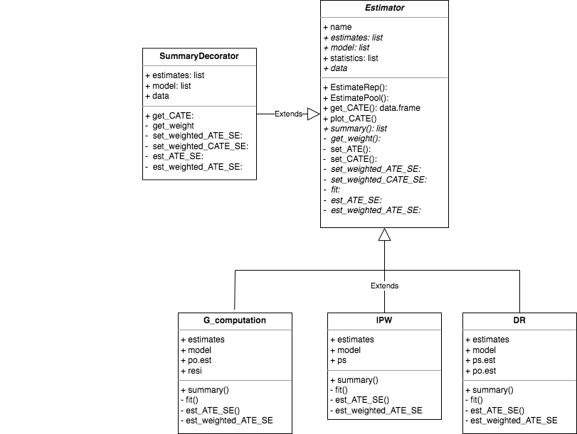

<!-- README.md is generated from README.Rmd. Please edit that file -->

```{r, include = FALSE}
knitr::opts_chunk$set(
  collapse = TRUE,
  comment = "#>",
  fig.path = "man/figures/README-",
  out.width = "100%"
)
```
# RCTrep

<!-- badges: start -->
The goal of RCTrep is to replicate treatment effect estimates of a target study using a source study. The package can replicate two types of studies: 

1. observational study with real world data 
2. randomized control trial with experiment data

The package can also replicate a target study in which only meta data is avaiable (point estimate and interval estimate of average treatment effect, conditional average treatment effect conditioning on univariate variable, and univariate distribution). 

The package use R6 Object-oriented programming system. Below is the class diagram defined in the package: 

The package new two objects of superclass Estimator for source study and target study, respectively, then 

1. each object estimate the treatment effect using G_computation, inverse propensity score weighting, or doubly robust estimator to ensure internal validity; 
2. communication between two objects via implementing the public method RCTrep(), e.g., source.obj$RCTrep(target.obj). Then source.obj get a estimates as close to target.obj as possible. This step is to conduct external validation. 

Below shows how the core function RCTREP() work:


<!-- badges: end -->

## Installation

<!-- You can install the released version of RCTrep from [CRAN](https://CRAN.R-project.org) with: -->

<!-- ``` r -->
<!-- install.packages("RCTrep") -->
<!-- ``` -->

You can install the development version from [GitHub](https://github.com/) with:

``` r
# install.packages("devtools")
devtools::install_github("duolajiang/RCTrep")
```

We will realease the package to CRAN soon. 

## Example

This is a basic example which shows you how to solve a common problem:

```{r example}
# library(RCTrep)
# 
# source.data <- RCTrep::source.data
# target.data <- RCTrep::target.data
# 
# output <- RCTREP(source.data=source.data, target.data=target.data,
#                  vars_name=list(confounders_internal=c("Stage2","pT","age","BRAF"),
#                                 confounders_external=c("Stage2","pT","age","BRAF"),
#                                 treatment_name=c('combined_chemo'),
#                                 outcome_name=c('vitstat')),
#                  stratification=c("Stage2","pT"))
# 
# summary(source.obj = output$source.obj, target.obj = output$target.obj)
```

You can also summarize conditional average treatment effect by specifying stratification and stratification_joint: 

```{r source_cate}
#output$source.obj$plot_CATE(stratification=c("Stage2","pT","BRAF"),stratification_joint = TRUE)
```
