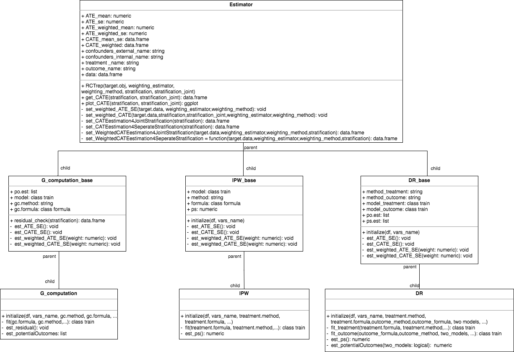

<!-- README.md is generated from README.Rmd. Please edit that file -->

# RCTrep

<!-- badges: start -->

The goal of RCTrep is to replicate treatment effect estimates of a
target study using a source study. The package can replicate two types
of studies:

1.  observational study with real world data
2.  randomized control trial with experiment data

The package can also replicate a target study in which only meta data is
avaiable (point estimate and interval estimate of average treatment
effect, conditional average treatment effect conditioning on univariate
variable, and univariate distribution).

The package use R6 Object-oriented programming system. Below is the
class diagram defined in the package:
 The package new two
objects of superclass Estimator for source study and target study,
respectively, then

1.  each object estimate the treatment effect using G\_computation,
    inverse propensity score weighting, or doubly robust estimator to
    ensure internal validity;
2.  communication between two objects via implementing the public method
    RCTrep(), e.g., source.obj$RCTrep(target.obj). Then source.obj get a
    estimates as close to target.obj as possible. This step is to
    conduct external validation.

Below shows how the core function RCTREP() work:

 <!-- badges: end -->

## Installation

<!-- You can install the released version of RCTrep from [CRAN](https://CRAN.R-project.org) with: -->

<!-- ``` r -->

<!-- install.packages("RCTrep") -->

<!-- ``` -->

You can install the development version from
[GitHub](https://github.com/) with:

``` r
# install.packages("devtools")
devtools::install_github("duolajiang/RCTrep")
```

We will realease the package to CRAN soon.

## Example

This is a basic example which shows you how to solve a common problem:

``` r
library(RCTrep)
#> 
#> Attaching package: 'RCTrep'
#> The following object is masked from 'package:base':
#> 
#>     summary

source.data <- RCTrep::source.data
target.data <- RCTrep::target.data

output <- RCTREP(source.data=source.data, target.data=target.data,
                 vars_name=list(confounders_internal=c("Stage2","pT","age","BRAF"),
                                confounders_external=c("Stage2","pT","age","BRAF"),
                                treatment_name=c('combined_chemo'),
                                outcome_name=c('vitstat')),
                 stratification=c("Stage2","pT"))
#> Loading required package: lattice
#> Loading required package: ggplot2

summary(source.obj = output$source.obj, target.obj = output$target.obj)
#> $summary.plot
```


    #> 
    #> $est.target
    #>     name value        cate         se size
    #> 1 Stage2     0 -0.20070536 0.03557522 1437
    #> 2 Stage2     1 -0.10410265 0.05320800  563
    #> 3     pT     1 -0.08823459 0.11535251   69
    #> 4     pT     2 -0.12739808 0.09425324  145
    #> 5     pT     3 -0.15523137 0.03440894 1377
    #> 6     pT    4A -0.27080612 0.09239320  292
    #> 7     pT    4B -0.25327783 0.14500448  117
    #> 
    #> $est.source
    #>     name value        cate         se size
    #> 1 Stage2     0 -0.18091521 0.04330931  975
    #> 2 Stage2     1 -0.08789583 0.03839094 1025
    #> 3     pT     1 -0.05199944 0.10180447   60
    #> 4     pT     2 -0.09059797 0.09341618  111
    #> 5     pT     3 -0.12102250 0.03295451 1486
    #> 6     pT    4A -0.21437729 0.09676331  243
    #> 7     pT    4B -0.21376100 0.15354067  100
    #> 
    #> $est.source.weighted
    #>     name value        cate         se size
    #> 1 Stage2     0 -0.18425890 0.04473386  967
    #> 2 Stage2     1 -0.09073558 0.03917013 1011
    #> 3     pT     1 -0.04664049 0.10960975   55
    #> 4     pT     2 -0.09052329 0.09843684  108
    #> 5     pT     3 -0.14927182 0.03755001 1481
    #> 6     pT    4A -0.22823583 0.10750251  240
    #> 7     pT    4B -0.23207905 0.18014894   94
    #> 
    #> $source.model
    #> Generalized Linear Model 
    #> 
    #> 2000 samples
    #>    5 predictor
    #>    2 classes: '0', '1' 
    #> 
    #> No pre-processing
    #> Resampling: Bootstrapped (25 reps) 
    #> Summary of sample sizes: 2000, 2000, 2000, 2000, 2000, 2000, ... 
    #> Resampling results:
    #> 
    #>   Accuracy   Kappa    
    #>   0.8256777  0.1823763
    #> 
    #> 
    #> $target.model
    #> Generalized Linear Model 
    #> 
    #> 2000 samples
    #>    5 predictor
    #>    2 classes: '0', '1' 
    #> 
    #> No pre-processing
    #> Resampling: Bootstrapped (25 reps) 
    #> Summary of sample sizes: 2000, 2000, 2000, 2000, 2000, 2000, ... 
    #> Resampling results:
    #> 
    #>   Accuracy   Kappa    
    #>   0.8104933  0.1622126

You can also summarize conditional average treatment effect by
specifying stratification and stratification\_joint:

``` r
output$source.obj$plot_CATE(stratification=c("Stage2","pT","BRAF"),stratification_joint = TRUE)
#> $plot
```


    #> 
    #> $est.cate
    #>    Stage2 pT BRAF        cate         se size
    #> 1       0  1    0 -0.09426355 1.55248126    2
    #> 2       0  1    1 -0.13894654 1.02457736    1
    #> 3       0  1    9 -0.04900637 0.10235824   49
    #> 4       0  1  999 -0.04889760 0.15127640    8
    #> 5       0  2    0 -0.08564174 0.45490904    1
    #> 6       0  2    1 -0.14864487 1.02606640    2
    #> 7       0  2    9 -0.08910858 0.10071492   96
    #> 8       0  2  999 -0.09837629 0.28077840   11
    #> 9       0  3    0 -0.21965307 0.46064603   14
    #> 10      0  3    1 -0.25436656 0.74831103    6
    #> 11      0  3    9 -0.18070539 0.06081061  495
    #> 12      0  3  999 -0.20982262 0.16073388   78
    #> 13      0 4A    0 -0.25342608 0.64198651    7
    #> 14      0 4A    1 -0.23309734 0.60776710    5
    #> 15      0 4A    9 -0.24886517 0.13279201  134
    #> 16      0 4A  999 -0.25638141 0.39602760   14
    #> 17      0 4B    0 -0.26176926 0.79884008    4
    #> 18      0 4B    1 -0.21854050 1.05867251    2
    #> 19      0 4B    9 -0.24911514 0.25693180   40
    #> 20      0 4B  999 -0.25178159 0.67080061    6
    #> 21      1  2    9 -0.03688029 0.28346236    1
    #> 22      1  3    0 -0.09932628 0.29620601   18
    #> 23      1  3    1 -0.14201638 0.36202362   15
    #> 24      1  3    9 -0.07419651 0.04378637  737
    #> 25      1  3  999 -0.08798220 0.10717472  123
    #> 26      1 4A    0 -0.15063876 0.67203475    2
    #> 27      1 4A    9 -0.14032343 0.17543294   67
    #> 28      1 4A  999 -0.17957095 0.42928394   14
    #> 29      1 4B    1 -0.22462912 1.09594810    3
    #> 30      1 4B    9 -0.17133023 0.20951896   41
    #> 31      1 4B  999 -0.17955493 0.95622150    4
