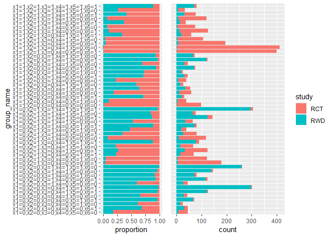
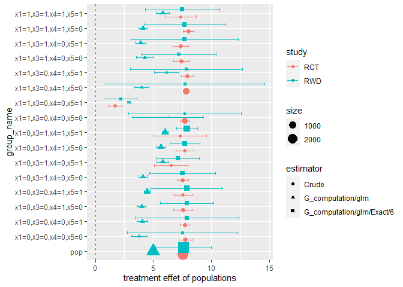

<!-- README.md is generated from README.Rmd. Please edit that file -->

# RCTrep: An R package for validation of methods for treatment effect estimation using real-world data

<!-- badges: start -->

**RCTrep** is an R package to validate methods for **conditional average
treatment effect (CATE)** estimation using **real-world data (RWD)**.
Validation of methods for treatment effect estimation using RWD is
challenging because we do not observe the true treatment effect for each
individual  - a fundamental
problem of **causal inference** - hence we can only estimate treatment
effect using observed data. Randomized control trial (RCT) assigns
individuals to treatment
 or control groups
 with known
probability  , hence two
groups are balanced in terms of observed and unobserved covariates. The
difference in outcomes between groups can be merely attributed to
realization of treatment
, and hence the
treatment effect is the simple difference in means of outcomes and is
unbiased given identification assumption holds. However, in case we
don’t know the true probability
 in RWD, without knowing the
ground truth, ***how can we validate the methods for treatment effect
estimation?***

## Method

**RCTrep** is an R package to enable easy validation of various methods
for treatment effect estimation using RWD by comparison to RCT data. We
identify under which conditions the estimate from RCT can be regarded as
the ground truth for methods validation using RWD. We assume the RWD and
RCT data are two random samples from a, potentially different,
population, and hence allow for a valid comparison of estimates of
treatment effect between two samples after population composition is
controlled for. We refer users to [RCTrep
vignettes](https://github.com/duolajiang/RCTrep/blob/master/vignettes/RCTrep%20vignettes.pdf "RCTrep: A R package for evaluation of methods for treatment effect estimation using real world data")
for theoretical elaboration, in which we illustrate why estimates from
RCT can be assumed as ground truth and how to use the estimates as the
surrogate of the ground truth of RWD from the view of **treatment
assignment mechanism** and **sampling mechansim**. We provide an diagram
to show how RCT data and RWD differ in two mechanisms in the following
figure:


We consider a set of candidate treatment effect estimators
 , where
, hence
 is an estimator of conditional
average treatment effect of population with characteristics
. We provide the package that
makes it easy to try out various estimators
 and select the best one using
the following evaluation metric:


where  is an unbiased estimate
of the average treatment effect derived from the RCT data,
 and
 are the empirical density of
 in RCT data and RWD,
 is a weight for individuals
in RWD with characteristics .
Hence the weighted distribution of covariates in RWD and distribution of
covariates in the RCT data are balanced. We compute
 on ***population*** and
***sub-population*** levels.

## Software overview

The package use R6 Object-oriented programming system. We provide an
overview of implementation of RCTrep in the following figure:


RCTrep provides two core classes, namely, **TEstimator** and
**SEstimator**, which are responsible for adjusting the **treatment
assignment mechanism** and the **sampling mechanism** respectively.

**TEstimator** has three subclasses for adjusting the treatment
assignment mechanism, namely,

  - G-computation,
  - Inverse propensity score weighting,
  - Doubly robust estimation

**SEstimator** has three subclasses for adjusting the sampling
mechanism, namely,

  - Exact matching,
  - Inverse sampling score weighting,
  - Subclassification

Users can specify modeling approaches for sampling score, propensity
score, outcome regression, and distance measure, etc. *Two objects*
instantiated using RWD and experimental RCT data *communicate within the
object of the class SEstimator*, sharing either **unit-level data"** or
**aggregated data** for computing the weights
.

**Summary** R6 class Summary combines estimates from an object of class
TEstimate and/or an object of class SEstimate, and plots and evaluates
estimates of average treatment effect and heterogeneous treatment
effect. The number of objects of class TEstimator or SEstimator passed
to its constructor is not limited.

The package can also generate synthetic RCT data based on meta data from
publications (point estimate and interval estimate of average treatment
effect, conditional average treatment effect conditioning on univariate
variable, and univariate distribution).

## Installation

<!-- You can install the released version of RCTrep from [CRAN](https://CRAN.R-project.org) with: -->

<!-- ``` r -->

<!-- install.packages("RCTrep") -->

<!-- ``` -->

You can install the development version from
[GitHub](https://github.com/) with:

``` r
# install.packages("devtools")
devtools::install_github("duolajiang/RCTrep")
```

We will realease the package to CRAN soon.

## Quick Start

We demonstrate the simple usage of RCTrep to validate methods for
treatment effect estimation. We use G-computation to adjust for the
treatment assignment mechanism - the method using RWD to validate. We
use exact matching to balance covariates between RWD and RCT data, and
obtain the weighted estimates of treatment effect using RWD. Then we can
implement the fair comparison between weighted estimates using RWD and
unbiased estimate using experimental data. Variables that may confound
causal association between treatment and outcome, and variables that may
lead to supurious association between sampling and outcomes still need
careful investigation and identification.

### Step 1: Identification

This step is to identifiy the variable set
**confounders\_treatment\_name** that confound causal relation between
treatment and outcome, and the variable set
**confounders\_sampling\_name** that can induce supurious difference in
estimates between RWD and RCT data.

``` r
library(RCTrep)
source.data <- RCTrep::source.data
target.data <- RCTrep::target.data

vars_name <- list(confounders_treatment_name=c("x1","x2","x3","x4","x5","x6"),
                  treatment_name=c('z'),
                  outcome_name=c('y')
)
confounders_sampling_name <- c("x1","x2","x3","x4","x5","x6")
```

### Step 2: Estimation

#### step 2.1: Estimation of treatment effect of RWD and RCT data

``` r
source.obj <- TEstimator_wrapper(
  Estimator = "G_computation",
  data = source.data,
  name = "RWD",
  vars_name = vars_name,
  outcome_method = "glm",
  outcome_formula = y ~ x1 + x2 + x3 + z + z:x1 + z:x2 +z:x3+ z:x6,
  data.public = TRUE
)
#> y ~ x1 + x2 + x3 + z + z:x1 + z:x2 + z:x3 + z:x6

target.obj <- TEstimator_wrapper(
  Estimator = "Crude",
  data = target.data,
  name = "RCT",
  vars_name = vars_name,
  data.public = TRUE,
  isTrial = TRUE
)
```

#### Step 2.2: Estimation of weighted treatment effect of RWD

``` r
# step2.2: Estimation of weighted treatment effect
source.obj.rep <- SEstimator_wrapper(estimator="Exact",
                                target.obj=target.obj,
                                source.obj=source.obj,
                                confounders_sampling_name=confounders_sampling_name)
source.obj.rep$EstimateRep(stratification = c("x1","x3","x4","x5"))
```

### Step 3: Assumptions and model diagnosis

This step diagnoses model assumption for G-computation (covariats
balance for IPW), treatment overlap assumption, outcome overlap
assumption, and sampling overlap assumption.

``` r
source.obj$summary()
#> $residuals.overall
#> [1] 7.939112e-15
#> 
#> $residuals.subgroups
#>    x1 x2 x3 x4 x5 x6 sample.size      res.mean       res.se          msr
#> 1   0  0  0  0  0  0          10 -1.746381e-14 5.070722e-15 5.363946e-28
#> 2   0  0  0  0  0  1          39 -7.182289e-15 3.546474e-15 5.295295e-28
#> 3   0  0  0  0  1  0          18 -1.082467e-14 4.025566e-15 3.926617e-28
#> 4   0  0  0  0  1  1          68 -9.812412e-16 2.621409e-15 4.613725e-28
#> 5   0  0  0  1  0  0          33 -1.635729e-14 2.766306e-15 5.124391e-28
#> 6   0  0  0  1  0  1         132 -1.247235e-14 1.816200e-15 5.876736e-28
#> 7   0  0  0  1  1  1         263 -2.244086e-15 1.339672e-15 4.752527e-28
#> 8   0  0  1  0  0  0          28 -2.869728e-14 2.017141e-15 9.333931e-28
#> 9   0  0  1  0  0  1         145 -2.361904e-14 1.393494e-15 8.374820e-28
#> 10  0  0  1  0  1  0          78 -2.095332e-14 1.554759e-15 6.251720e-28
#> 11  0  0  1  1  0  0         117 -2.563144e-14 1.153694e-15 8.113682e-28
#> 12  0  0  1  1  1  0         261 -1.754152e-14 8.359062e-16 4.893773e-28
#> 13  0  1  0  0  0  0           2  7.577272e-15 2.248202e-15 6.246946e-29
#> 14  0  1  0  0  0  1           6  1.187939e-14 1.299008e-15 1.495569e-28
#> 15  0  1  0  0  1  0           5  8.026912e-15 1.101389e-15 6.928356e-29
#> 16  0  1  0  0  1  1          13  1.361731e-14 8.653648e-16 1.944175e-28
#> 17  0  1  0  1  0  0          10  8.476553e-15 6.868369e-16 7.609765e-29
#> 18  0  1  0  1  0  1          31  1.240943e-14 5.551225e-16 1.632387e-28
#> 19  0  1  0  1  1  0          15  8.326673e-15 5.664936e-16 7.382629e-29
#> 20  0  1  0  1  1  1          89  1.328712e-14 3.259036e-16 1.858944e-28
#> 21  0  1  1  0  0  1          29  3.629281e-15 9.706652e-18 1.317432e-29
#> 22  0  1  1  0  1  0          11 -2.523234e-16 1.638205e-15 2.690083e-29
#> 23  0  1  1  0  1  1          75  3.601563e-15 6.406410e-18 1.297430e-29
#> 24  0  1  1  1  0  0          33 -5.786617e-16 9.302072e-16 2.802398e-29
#> 25  0  1  1  1  0  1         124  3.623446e-15 4.813443e-18 1.313221e-29
#> 26  0  1  1  1  1  0          58 -2.277871e-15 7.093788e-16 3.387214e-29
#> 27  0  1  1  1  1  1         301  3.591442e-15 3.054962e-18 1.290126e-29
#> 28  1  0  0  0  0  0           2  5.406786e-14 1.521006e-14 3.154679e-27
#> 29  1  0  0  0  0  1           7  5.034068e-14 7.412166e-15 2.863826e-27
#> 30  1  0  0  0  1  0           4  5.406786e-14 8.781530e-15 3.154679e-27
#> 31  1  0  0  0  1  1          18  5.895284e-14 4.873762e-15 3.879248e-27
#> 32  1  0  0  1  0  0          10  5.102585e-14 4.967583e-15 2.825729e-27
#> 33  1  0  0  1  0  1          35  4.919240e-14 3.012446e-15 2.728436e-27
#> 34  1  0  0  1  1  0          23  5.869701e-14 3.088960e-15 3.655256e-27
#> 35  1  0  1  0  0  0           8  3.880229e-14 4.033804e-15 1.619519e-27
#> 36  1  0  1  0  0  1          24  3.990327e-14 2.952069e-15 1.792709e-27
#> 37  1  0  1  0  1  0          23  4.657144e-14 2.604928e-15 2.318184e-27
#> 38  1  0  1  0  1  1          71  5.817256e-14 1.844637e-15 3.622235e-27
#> 39  1  0  1  1  0  0          37  3.996803e-14 1.877558e-15 1.724351e-27
#> 40  1  0  1  1  0  1         121  4.445296e-14 1.506263e-15 2.248325e-27
#> 41  1  0  1  1  1  0          67  4.698729e-14 1.496331e-15 2.355580e-27
#> 42  1  1  0  1  0  1           9  7.704948e-14 3.510833e-16 5.937608e-27
#> 43  1  1  0  1  1  0           6  7.038814e-14 1.825633e-15 4.971155e-27
#> 44  1  1  0  1  1  1          24  7.766010e-14 1.804344e-16 6.031840e-27
#> 45  1  1  1  0  0  0           2  6.339373e-14 6.550316e-15 4.061672e-27
#> 46  1  1  1  0  0  1           5  6.896705e-14 5.982856e-16 4.757886e-27
#> 47  1  1  1  0  1  0           2  6.339373e-14 6.550316e-15 4.061672e-27
#> 48  1  1  1  0  1  1          13  6.825310e-14 3.254245e-16 4.659756e-27
#> 49  1  1  1  1  0  0           6  6.557717e-14 2.761856e-15 4.338505e-27
#> 50  1  1  1  1  0  1          26  6.928646e-14 2.166783e-16 4.801787e-27
#> 51  1  1  1  1  1  0          19  6.304898e-14 1.541784e-15 4.017962e-27
#> 52  1  1  1  1  1  1          62  6.825007e-14 1.441741e-16 4.659339e-27
#>            sesr
#> 1  1.097778e-28
#> 2  3.898004e-29
#> 3  8.715089e-29
#> 4  2.881245e-29
#> 5  5.988872e-29
#> 6  1.996223e-29
#> 7  1.472461e-29
#> 8  8.028521e-29
#> 9  4.061110e-29
#> 10 6.188173e-29
#> 11 4.591876e-29
#> 12 3.327032e-29
#> 13 3.407047e-29
#> 14 3.353089e-29
#> 15 1.669105e-29
#> 16 2.233739e-29
#> 17 1.040870e-29
#> 18 1.432920e-29
#> 19 8.584952e-30
#> 20 8.412447e-30
#> 21 7.004757e-32
#> 22 5.638197e-30
#> 23 4.623153e-32
#> 24 3.201486e-30
#> 25 3.473597e-32
#> 26 2.441463e-30
#> 27 2.204598e-32
#> 28 1.644750e-27
#> 29 8.739365e-28
#> 30 9.495970e-28
#> 31 5.746443e-28
#> 32 5.371732e-28
#> 33 3.551845e-28
#> 34 3.340269e-28
#> 35 3.627522e-28
#> 36 2.956264e-28
#> 37 2.342561e-28
#> 38 1.847259e-28
#> 39 1.688451e-28
#> 40 1.508404e-28
#> 41 1.345622e-28
#> 42 5.417953e-29
#> 43 2.622757e-28
#> 44 2.784482e-29
#> 45 8.304980e-28
#> 46 8.223173e-29
#> 47 8.304980e-28
#> 48 4.472816e-29
#> 49 3.501687e-28
#> 50 2.978148e-29
#> 51 1.954789e-28
#> 52 1.981610e-29
#> 
#> $plot.res.mse
```


``` r
source.obj$diagnosis_t_overlap()
```


``` r
target.obj$diagnosis_t_overlap()
```


``` r
source.obj.rep$diagnosis_s_overlap()
```



### Step 4: Model Validation

This step compare the estimates from RWD with those from RCT data, and
validate difference methods using RWD.

``` r
fusion <- Summary$new(target.obj,
                      source.obj,
                      source.obj.rep)
fusion$evaluate()
#> # A tibble: 34 x 7
#> # Groups:   group_name [17]
#>    group_name        estimator          size     mse len_ci agg.est agg.reg
#>    <chr>             <chr>             <dbl>   <dbl>  <dbl> <lgl>   <lgl>  
#>  1 pop               G_computation+Ex…  2618 0        4.52  TRUE    TRUE   
#>  2 pop               G_computation      2618 5.88e+2  0.237 FALSE   TRUE   
#>  3 x1=0,x3=0,x4=0,x… G_computation+Ex…    57 1.03e+0 14.6   TRUE    TRUE   
#>  4 x1=0,x3=0,x4=0,x… G_computation        57 1.84e+3  1.11  FALSE   TRUE   
#>  5 x1=0,x3=0,x4=0,x… G_computation+Ex…   104 1.7 e-2  9.02  TRUE    TRUE   
#>  6 x1=0,x3=0,x4=0,x… G_computation       104 1.66e+3  0.886 FALSE   TRUE   
#>  7 x1=0,x3=0,x4=1,x… G_computation+Ex…   206 1.61e+0  6.06  TRUE    TRUE   
#>  8 x1=0,x3=0,x4=1,x… G_computation       206 1.46e+3  0.666 FALSE   TRUE   
#>  9 x1=0,x3=0,x4=1,x… G_computation+Ex…   367 1.97e+0  6.20  TRUE    TRUE   
#> 10 x1=0,x3=0,x4=1,x… G_computation       367 9.41e+2  0.547 FALSE   TRUE   
#> # … with 24 more rows
fusion$plot()
```


