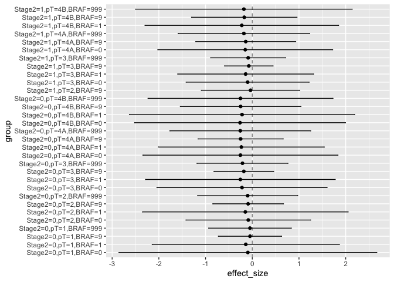

<!-- README.md is generated from README.Rmd. Please edit that file -->

# RCTrep

<!-- badges: start -->

The goal of RCTrep is to replicate treatment effect estimates of a
target study using a source study. The package can replicate two types
of studies:

1.  observational study with real world data
2.  randomized control trial with experiment data

The package can also replicate a target study in which only meta data is
avaiable (point estimate and interval estimate of average treatment
effect, conditional average treatment effect conditioning on univariate
variable, and univariate distribution).

The package use R6 Object-oriented programming system. Below is the
class diagram defined in the package:
 The package new two objects of
superclass Estimator for source study and target study, respectively,
then

1.  each object estimate the treatment effect using G\_computation,
    inverse propensity score weighting, or doubly robust estimator to
    ensure internal validity;
2.  communication between two objects via implementing the public method
    RCTrep(), e.g., source.obj$RCTrep(target.obj). Then source.obj get a
    estimates as close to target.obj as possible. This step is to
    conduct external validation.

Below shows how the core function RCTREP() work:

 <!-- badges: end -->

## Installation

<!-- You can install the released version of RCTrep from [CRAN](https://CRAN.R-project.org) with: -->

<!-- ``` r -->

<!-- install.packages("RCTrep") -->

<!-- ``` -->

You can install the development version from
[GitHub](https://github.com/) with:

``` r
# install.packages("devtools")
devtools::install_github("duolajiang/RCTrep")
```

We will realease the package to CRAN soon.

## Example

This is a basic example which shows you how to solve a common problem:

``` r
library(RCTrep)

source.data <- RCTrep::source.data
target.data <- RCTrep::target.data

output <- RCTREP(source.data=source.data, target.data=target.data,
                 vars_name=list(confounders_internal=c("Stage2","pT","age","BRAF"),
                                confounders_external=c("Stage2","pT","age","BRAF"),
                                treatment_name=c('combined_chemo'),
                                outcome_name=c('vitstat')),
                 stratification=c("Stage2","pT"))
#> Loading required package: lattice
#> Loading required package: ggplot2
#> Warning in target$prop/source$prop: longer object length is not a multiple
#> of shorter object length

#> Warning in target$prop/source$prop: longer object length is not a multiple
#> of shorter object length
#> Warning in self$data$y1.hat[index] * weight.norm: longer object length is
#> not a multiple of shorter object length
#> Warning in self$data$y0.hat[index] * weight.norm: longer object length is
#> not a multiple of shorter object length
#> Warning in self$data$se[index] * (weight)^2: longer object length is not a
#> multiple of shorter object length
#> Warning in target$prop/source$prop: longer object length is not a multiple
#> of shorter object length

#> Warning in target$prop/source$prop: longer object length is not a multiple
#> of shorter object length

#> Warning in target$prop/source$prop: longer object length is not a multiple
#> of shorter object length

#> Warning in target$prop/source$prop: longer object length is not a multiple
#> of shorter object length

#> Warning in target$prop/source$prop: longer object length is not a multiple
#> of shorter object length

summary(source.obj = output$source.obj, target.obj = output$target.obj)
#> $summary.plot
```


    #> 
    #> $est.target
    #>     name value     y1.hat    y0.hat        cate        se size
    #> 1 Stage2     0 0.15020963 0.3509150 -0.20070536 0.3067094   60
    #> 2 Stage2     1 0.05424071 0.1583434 -0.10410265 0.3184142   24
    #> 3     pT     1 0.04251326 0.1307478 -0.08823459 0.3828676   27
    #> 4     pT     2 0.06659381 0.1939919 -0.12739808 0.4252886   22
    #> 5     pT     3 0.09140466 0.2466360 -0.15523137 0.2937424   19
    #> 6     pT    4A 0.27914831 0.5499544 -0.27080612 0.4731162   NA
    #> 7     pT    4B 0.22584380 0.4791216 -0.25327783 0.5660573   NA
    #> 
    #> $est.source
    #>     name value     y1.hat     y0.hat        cate        se size
    #> 1 Stage2     0 0.17375337 0.35466858 -0.18091521 0.3474523   59
    #> 2 Stage2     1 0.05492594 0.14282177 -0.08789583 0.2735155   33
    #> 3     pT     1 0.02933538 0.08133482 -0.05199944 0.3505954   29
    #> 4     pT     2 0.05543867 0.14603664 -0.09059797 0.3864697   22
    #> 5     pT     3 0.08854706 0.20956956 -0.12102250 0.2869981   20
    #> 6     pT    4A 0.24970183 0.46407912 -0.21437729 0.4878535   NA
    #> 7     pT    4B 0.25536326 0.46912426 -0.21376100 0.6260017   NA
    #> 
    #> $est.source.weighted
    #>     name value     y1.hat    y0.hat        cate        se      size
    #> 1 Stage2     0 0.13994319 0.2836440 -0.14370084 1.0636575 238.50010
    #> 2 Stage2     1 0.09727598 0.2380736 -0.14079765 1.6969254 412.56493
    #> 3     pT     1 0.04794144 0.1286824 -0.08074093 1.3520865  74.61869
    #> 4     pT     2 0.10816980 0.2528174 -0.14464759 1.3038907  27.33331
    #> 5     pT     3 0.10561276 0.2421220 -0.13650921 0.8534925 196.88136
    #> 6     pT    4A 0.21167625 0.3805898 -0.16891359 0.7976260 133.67450
    #> 7     pT    4B 0.27423793 0.4793015 -0.20506356 1.4231717  51.10926
    #> 
    #> $source.model
    #> Generalized Linear Model 
    #> 
    #> 2000 samples
    #>    5 predictor
    #>    2 classes: '0', '1' 
    #> 
    #> No pre-processing
    #> Resampling: Bootstrapped (25 reps) 
    #> Summary of sample sizes: 2000, 2000, 2000, 2000, 2000, 2000, ... 
    #> Resampling results:
    #> 
    #>   Accuracy   Kappa    
    #>   0.8258472  0.1781374
    #> 
    #> 
    #> $target.model
    #> Generalized Linear Model 
    #> 
    #> 2000 samples
    #>    5 predictor
    #>    2 classes: '0', '1' 
    #> 
    #> No pre-processing
    #> Resampling: Bootstrapped (25 reps) 
    #> Summary of sample sizes: 2000, 2000, 2000, 2000, 2000, 2000, ... 
    #> Resampling results:
    #> 
    #>   Accuracy   Kappa    
    #>   0.8105558  0.1742928

You can also summarize conditional average treatment effect by
specifying stratification and stratification\_joint:

``` r
output$source.obj$plot_CATE(stratification=c("Stage2","pT","BRAF"),stratification_joint = TRUE)
#> $plot
```



    #> 
    #> $est.cate
    #>    Stage2 pT BRAF     y1.hat     y0.hat        cate        se size
    #> 1       0  1    0 0.05731483 0.15157838 -0.09426355 1.3942652    2
    #> 2       0  1    1 0.09188071 0.23082725 -0.13894654 1.0122141    1
    #> 3       0  1    9 0.02726808 0.07627445 -0.04900637 0.3417053    3
    #> 4       0  1  999 0.02718456 0.07608216 -0.04889760 0.4477164    4
    #> 5       0  2    0 0.05042006 0.13606180 -0.08564174 0.6744694    1
    #> 6       0  2    1 0.11017879 0.25882366 -0.14864487 1.1120559    2
    #> 7       0  2    9 0.05411925 0.14322783 -0.08910858 0.3820634    4
    #> 8       0  2  999 0.06068908 0.15906538 -0.09837629 0.5414762    3
    #> 9       0  3    0 0.21055792 0.43021098 -0.21965307 0.9202284    4
    #> 10      0  3    1 0.30704249 0.56140905 -0.25436656 1.0256866    2
    #> 11      0  3    9 0.14343430 0.32413969 -0.18070539 0.3232542    4
    #> 12      0  3  999 0.18790453 0.39772716 -0.20982262 0.4925035    4
    #> 13      0 4A    0 0.40033870 0.65376477 -0.25342608 1.0546241    4
    #> 14      0 4A    1 0.53862960 0.77172694 -0.23309734 0.8967168    2
    #> 15      0 4A    9 0.30853511 0.55740027 -0.24886517 0.4608044    4
    #> 16      0 4A  999 0.36967555 0.62605696 -0.25638141 0.7615609    3
    #> 17      0 4B    0 0.35631182 0.61808108 -0.26176926 1.1400334    3
    #> 18      0 4B    1 0.58480427 0.80334477 -0.21854050 1.2181311    2
    #> 19      0 4B    9 0.35040356 0.59951871 -0.24911514 0.6524995    4
    #> 20      0 4B  999 0.40722156 0.65900315 -0.25178159 1.0002435    3
    #> 21      1  2    9 0.01988731 0.05676760 -0.03688029 0.5324118    1
    #> 22      1  3    0 0.06168030 0.16100657 -0.09932628 0.6653407    4
    #> 23      1  3    1 0.09759266 0.23960903 -0.14201638 0.7349027    3
    #> 24      1  3    9 0.04346998 0.11766649 -0.07419651 0.2627665    4
    #> 25      1  3  999 0.05303112 0.14101332 -0.08798220 0.4057104    4
    #> 26      1 4A    0 0.10480429 0.25544305 -0.15063876 0.9455681    2
    #> 27      1 4A    9 0.09723531 0.23755873 -0.14032343 0.5406073    4
    #> 28      1 4A  999 0.13846357 0.31803452 -0.17957095 0.7106287    3
    #> 29      1 4B    1 0.19782425 0.42245337 -0.22462912 1.0468754    1
    #> 30      1 4B    9 0.12965033 0.30098057 -0.17133023 0.5702821    4
    #> 31      1 4B  999 0.14321553 0.32277046 -0.17955493 1.1713433    3
