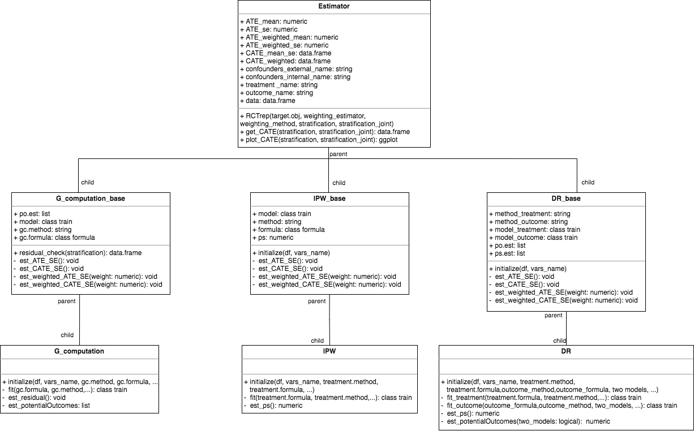

```{r, include = FALSE}
knitr::opts_chunk$set(
  collapse = TRUE,
  comment = "#>"
)
```

# Overview of package
## structure of the package

# Case study with synthetic NCR data
```{r}
library(RCTrep)
library(dplyr)

source.data <- RCTrep::source.data
target.data <- RCTrep::target.data

head(source.data)
```

```{r}
vars_name <- list(confounders_treatment=c("Stage2","age","pT","BRAF","male"),
                  confounders_sampling=c("Stage2","age","pT","BRAF","male"),
                  treatment_name=c('combined_chemo'),
                  outcome_name=c('vitstat')
)

source.obj <- Estimator_wrapper(
  Estimator = "G_computation",
  data = source.data,
  name = "The Netherlands",
  vars_name = vars_name,
  outcome_method = "glm",
  outcome_formula = outcome_formula,
  data.public = data.public
)

```

<!-- # Problem formulation -->
<!-- ## interval validity -->
<!-- ## external validity -->


<!-- ## classess -->
<!-- ###  -->
<!-- ## wrapp up functions -->

<!-- # Case study with synthetic NCR data -->


<!-- ## Data overview -->
<!-- ## run locally  -->
<!-- ## run centrally  -->
<!-- ## summary  -->

<!-- # Summary -->


